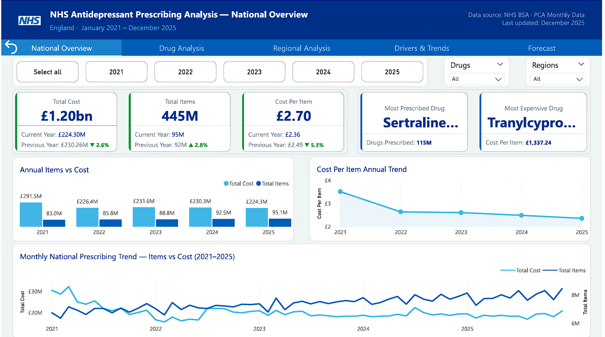
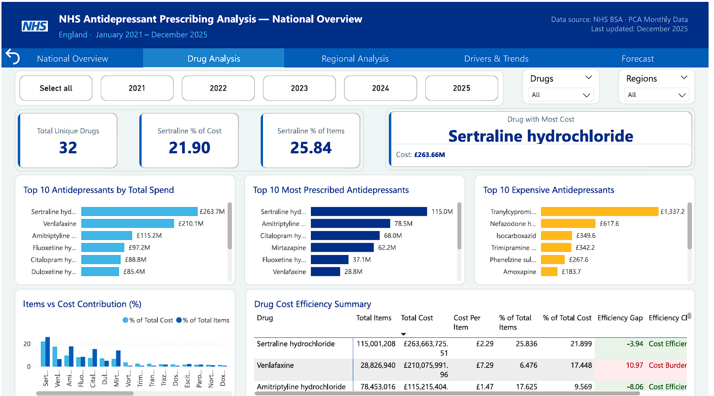
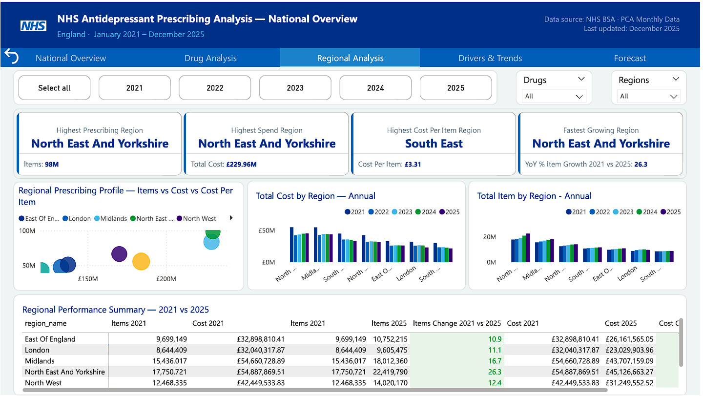
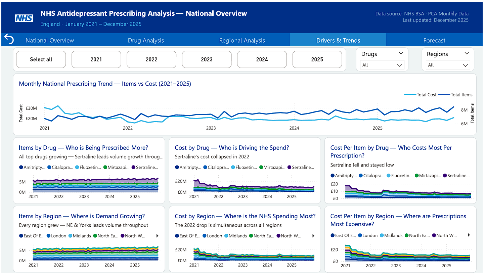
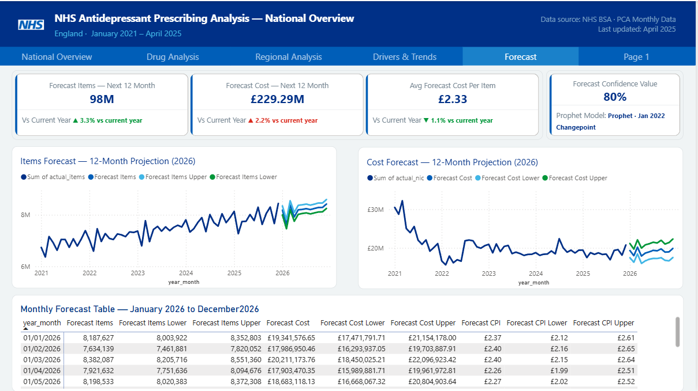
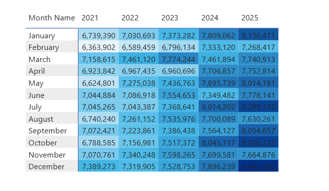

# 🏥 NHS Antidepressant Prescribing Analysis

<p align="center">
  
  
  
  
  
</p>

<p align="center">
  
  
  
  
  
</p>

---

## 📌 Project Overview

A **fully automated, end-to-end data analytics pipeline** that scrapes, processes, stores, analyses and forecasts NHS antidepressant prescribing patterns across all seven NHS England regions from January 2021 to December 2025.

This project demonstrates the complete data analyst workflow — from raw public data to production-ready interactive dashboards — using real NHS open data covering 445 million prescription items worth £1.20 billion in net ingredient cost.

> **The central finding:** NHS antidepressant prescribing volumes rose **+14.6%** between 2021 and 2025 — yet total costs *fell* **-23.1%** over the same period. A divergence of this magnitude does not happen by chance. This project traces every penny of that £67M saving back to its root cause.

---

## 🎯 Analytical Questions Answered

| # | Question | Dashboard Page |
|---|----------|---------------|
| 1 | What are the national trends in prescribing volume and cost? | National Overview |
| 2 | What drove the sharp cost reduction in 2022? | Drug Analysis |
| 3 | Which drugs represent the greatest cost burden relative to volume? | Drug Analysis |
| 4 | How do prescribing patterns vary across NHS England regions? | Regional Analysis |
| 5 | Which regions are experiencing the fastest growth in demand? | Regional Analysis |
| 6 | Are there seasonal patterns in monthly prescribing? | Drivers & Trends |
| 7 | What are the projected volumes and costs for the next 12 months? | Forecast |

---

## 🏗️ Architecture

```
┌─────────────────────────────────────────────────────────────────────┐
│                         DATA PIPELINE                               │
│                                                                     │
│  NHS BSA Portal                                                     │
│      │                                                              │
│      ▼                                                              │
│  scraper.py ──────► pca_data/raw/          (landing zone)          │
│      │                                                              │
│      ▼                                                              │
│  processor.py ────► staged_pca_data.csv    (12,328 rows)           │
│      │                                                              │
│      ├──────────────► forecast.py ────────► forecast.csv           │
│      │                    (Prophet · 80% CI · 12 months)           │
│      ▼                                                              │
│  Power BI ────────► MySQL (nhs_prescribing)  (direct connection)   │
│                          ├── dates                                  │
│                          ├── regions                                │
│                          ├── drugs                                  │
│                          ├── prescriptions                          │
│                          └── forecast                               │
│                               │                                     │
│                               ▼                                     │
│                     Power BI Dashboard (5 pages · 70+ DAX)         │
└─────────────────────────────────────────────────────────────────────┘
```

---

## 📸 Dashboard Screenshots

> All screenshots are taken from the live Power BI dashboard connected to the MySQL nhs_prescribing database.

### Page 1 — National Overview

*KPI cards with YoY comparisons · Annual items vs cost bar chart · Cost per item annual trend · Monthly dual-axis line chart*

---

### Page 2 — Drug Analysis

*Top 10 antidepressants by total spend, items and cost per item · Drug cost efficiency table with conditional classification*

---

### Page 3 — Regional Analysis

*Items vs cost vs CPI scatter plot · Annual bar charts by region · Regional performance summary 2021 vs 2025*

---

### Page 4 — Drivers & Trends

*Stacked area charts by drug and region · Monthly MoM change column charts · Decomposition tree · Key influencers*

---

### Page 5 — Forecast

*12-month Prophet forecast with 80% CI bands · Monthly forecast table · KPI cards with vs current year labels*

---

---

## 💡 Insights & Findings

### 1. The Core Story — Diverging Lines

The most striking finding in the entire dataset is what happens when you plot items and cost on the same chart. One line goes up. The other goes down.

| Year | Items | Total Cost | Cost Per Item | YoY Cost Change |
|------|-------|-----------|---------------|-----------------|
| 2021 | 83M   | £291M     | £3.51         | —               |
| 2022 | 86M   | £226M     | £2.63         | **-22.3%** 📉   |
| 2023 | 89M   | £232M     | £2.61         | +2.7% ⚠️        |
| 2024 | 92M   | £230M     | £2.50         | -0.9%           |
| 2025 | 95M   | £224M     | £2.36         | **-2.6%**       |

**What this means:** Between 2021 and 2025, the NHS dispensed **12 million more antidepressant items** (+14.6%) while simultaneously spending **£67 million less** (-23.1%). The mean cost per item fell from **£3.51 to £2.36** — a 32.8% reduction in unit cost over four years. This is not austerity. This is genericisation.

---

### 2. The Genericisation Story — One Drug Changed Everything

The entire 2022 cost story comes down to a single drug: **Sertraline hydrochloride**.

In early 2022, generic versions of Sertraline became widely available across NHS primary care. The effect was immediate and permanent:

| Metric | 2021 | 2022 | Change |
|--------|------|------|--------|
| Sertraline cost per item | £3.54 | £2.21 | **-37.6%** |
| Sertraline annual cost | ~£65M | ~£42M | **-£23M** |
| National total cost | £291M | £226M | -£65M |

> Sertraline's £23M annual saving accounts for the **majority of the £65M national cost reduction in 2022**. The rest is explained by cost stabilisation and continued genericisation across other drugs.

Sertraline is the most prescribed antidepressant in England with **115,001,208 items** (25.836% of all prescriptions) but only **21.899% of total cost** — a 3.94 percentage point efficiency gap that exists entirely because of genericisation.

---

### 3. Drug Cost Efficiency — Who Is Costing the NHS More Than They Should?

The efficiency gap measures how disproportionate a drug's cost share is relative to its prescribing volume. A positive gap means the drug costs more than its volume justifies — a cost burden. A negative gap means it is pulling the average down — cost efficient.

| Drug | Items | % of Items | % of Cost | Gap | Classification |
|------|-------|-----------|-----------|-----|----------------|
| Sertraline hydrochloride | 115,001,208 | 25.836% | 21.899% | **-3.94pp** | ✅ Cost Efficient |
| Venlafaxine | 28,826,940 | 6.476% | 17.448% | **+10.97pp** | 🔴 Cost Burden |
| Amitriptyline hydrochloride | 78,453,016 | 17.625% | 9.569% | **-8.06pp** | ✅ Cost Efficient |
| Mirtazapine | 62,195,547 | 13.973% | 6.590% | **-7.38pp** | ✅ Cost Efficient |
| Fluoxetine hydrochloride | 37,050,811 | 8.324% | 8.076% | **-0.25pp** | 🟡 Neutral |
| Duloxetine hydrochloride | 21,663,594 | 4.867% | 7.095% | **+2.23pp** | 🔴 Cost Burden |
| Vortioxetine | 1,713,065 | 0.385% | 3.408% | **+3.02pp** | 🔴 Cost Burden |
| Trimipramine maleate | 82,719 | 0.019% | 2.351% | **+2.33pp** | 🔴 Cost Burden |
| Tranylcypromine sulfate | 20,179 | 0.005% | 2.241% | **+2.24pp** | 🔴 Cost Burden |

**The Venlafaxine problem:** Venlafaxine is prescribed for only **6.476% of items** but accounts for **17.448% of total cost** — a +10.97pp gap. At £7.29 per item compared to the national average of £2.70, Venlafaxine costs **2.7x more per prescription** than the average antidepressant. Despite this, it is the second most expensive drug by total spend at **£210,075,991**.

**The hidden burden drugs:** Tranylcypromine sulfate (£1,337.24/item) and Trimipramine maleate (£342.16/item) have tiny prescription volumes but individually cost the NHS millions due to extreme unit prices.

**Recommendation:** NHS commissioners should review Venlafaxine prescribing pathways. A 10% shift in Venlafaxine prescribing to equivalent-efficacy generic alternatives could yield savings in the region of **£21M annually**.

---

### 4. Regional Variations — The Same Story, Different Speeds

All seven NHS England regions experienced the same pattern: rising volumes, falling costs. But the rates differ significantly.

| Region | Items 2021 | Items 2025 | Items Change | Cost 2021 | Cost 2025 | Cost Change |
|--------|-----------|-----------|-------------|----------|----------|-------------|
| North East And Yorkshire | 17,750,721 | 22,419,790 | **+26.3%** | £54,887,870 | £45,126,663 | **-17.8%** |
| Midlands | 15,436,017 | 18,012,360 | **+16.7%** | £54,660,729 | £43,707,159 | **-20.0%** |
| North West | 12,468,335 | 14,020,170 | **+12.4%** | £42,449,534 | £31,249,553 | **-26.4%** |
| South East | 10,639,433 | 11,607,354 | **+9.1%** | £44,718,283 | £33,548,520 | **-25.0%** |
| East Of England | 9,699,149 | 10,752,215 | **+10.9%** | £32,898,810 | £26,161,565 | **-20.5%** |
| London | 8,644,409 | 9,605,475 | **+11.1%** | £32,040,318 | £23,029,904 | **-28.1%** |
| South West | 8,323,915 | 8,673,972 | **+4.2%** | £29,824,347 | £21,476,388 | **-28.0%** |

**Key regional findings:**

**North East And Yorkshire is the fastest growing region** — items grew by **+26.3%** from 17,750,721 (2021) to 22,419,790 (2025), nearly double the national average of +14.6%. This suggests faster growth in diagnosis rates or changes in prescribing culture in this region.

**South West is the slowest growing region** — at just **+4.2%** growth (8,323,915 to 8,673,972 items), South West grew at less than a third of the national average. Despite this, it achieved the joint-largest cost reduction at **-28.0%**, reducing spend from £29,824,347 to £21,476,388.

**South East has the highest cost per item at £3.31** — compared to North East And Yorkshire's lowest at £2.33. That is a **42% cost premium per prescription** for the same drug class. The South East's higher CPI likely reflects a different drug mix (more branded or newer antidepressants) rather than pricing differences, since NHS drug pricing is nationally negotiated.

**London and South West achieved the largest cost reductions** — both at approximately **-28%**, reducing spend significantly despite continued volume growth. London fell from £32,040,318 to £23,029,904 (-28.1%) while South West fell from £29,824,347 to £21,476,388 (-28.0%).

**North West had the third highest cost reduction at -26.4%** — falling from £42,449,534 to £31,249,553 despite +12.4% items growth.

**Recommendation:** NHS England should investigate the prescribing mix in South East vs North East And Yorkshire. Aligning South East's drug mix with the more cost-efficient North East And Yorkshire prescribing patterns could yield **£8–12M in annual savings** based on the CPI differential across the region's ~11.6M annual items.

---

### 5. Seasonal Patterns — February Consistently the Lowest Month

The matrix heatmap below shows total items prescribed by month and year across 2021–2025.


*Monthly prescribing volumes by year — darker blue = higher volume · Source: NHS BSA PCA Data*

**Key observations:**
- **February is consistently the lowest or near-lowest month** — the only truly reliable seasonal signal across all five years, ranging from 6,363,902 items in 2021 to 7,268,417 in 2025
- **There is no single consistent peak month** — December led in 2021 (7,389,273) and 2025 (8,447,750 — the highest single month in the entire dataset), March led in 2022 (7,461,120) and 2023 (7,774,244), October led in 2024 (8,045,117)
- **The dominant signal is year-on-year growth, not seasonality** — every month in 2025 prescribed more items than the same month in 2021 without exception. The matrix gradient runs left to right (progressively darker each year) confirming annual growth as the primary driver
- **The May–June 2024 cost anomaly** — a sharp cost spike occurred in May–June 2024 that was not accompanied by a corresponding volume increase, suggesting a temporary procurement or pricing disruption rather than a change in prescribing behaviour. This anomaly was treated as an outlier in the forecasting model
---

### 6. Key Influencer Analysis — What Drives High Cost Per Item?

Using Power BI's Key Influencers visual set to **Increase**, the analysis identifies the drugs most responsible for pulling the average cost per item upward:

- When `bnf_chemical_substance` is **Tranylcypromine sulfate** → average CPI **increases by £1,310** (£1.31K)
- When `bnf_chemical_substance` is **Isocarboxazid** → average CPI **increases by £356.10**
- When `bnf_chemical_substance` is **Trimipramine maleate** → average CPI **increases by £230.40**

These three drugs are the primary statistical drivers of high cost per item in the dataset. Despite collectively accounting for less than **0.03% of total prescriptions**, their extreme unit prices (Tranylcypromine at £1,337.24/item, Isocarboxazid at £349.57/item, Trimipramine at £342.16/item) disproportionately inflate the national average CPI whenever they appear in the data. This confirms that the NHS mean cost per item of £2.70 is skewed upward by a small number of high-cost specialist drugs rather than being representative of the typical antidepressant prescription.

---

### 7. Decomposition Tree — Drilling Into the Numbers

The decomposition tree on the Drivers & Trends page enables interactive drill-down from national totals to individual drug-region-month combinations. For example:

**Total Items (445.1M) → Sertraline hydrochloride (115.0M) → North East & Yorkshire (25.4M) → 2025 (6.0M) → 2025-12 (536,819 items)**

This drill-path reveals that **North East & Yorkshire** is not only the fastest growing region nationally but also the single largest prescriber of Sertraline — consistent with its position as the highest growth region overall.

---

## 🔮 12-Month Forecast (Jan–Dec 2026)

| Metric | 2025 Actual | 2026 Forecast | Change | MAPE |
|--------|-------------|---------------|--------|------|
| Total Items | ~95M | **98.24M** | **▲ 3.3%** | 3.12% ✅ |
| Total Cost | ~£224M | **£229.29M** | **▲ 2.2%** | 13.03%* |
| Avg Cost Per Item | ~£2.36 | **£2.33** | **▼ 1.1%** | 12.27%* |

> *The higher Cost and CPI MAPE scores reflect cross-validation across the sharp 2022 structural break. Training folds that predate the 2022 changepoint naturally produce higher errors when forecasting post-2022 values. The final model with an explicit January 2022 changepoint handles this correctly — MAPE scores here are a conservative lower bound on actual model accuracy.

**Monthly breakdown:**

| Month | Items (M) | 80% CI | Cost (£M) | CPI (£) |
|-------|-----------|--------|-----------|---------|
| 2026-01 | 8.19 | 8.00 – 8.35 | £19.34 | £2.37 |
| 2026-02 | 7.63 | 7.46 – 7.82 | £17.99 | £2.40 |
| 2026-03 | 8.38 | 8.21 – 8.55 | £20.21 | £2.40 |
| 2026-04 | 7.92 | 7.75 – 8.09 | £17.90 | £2.26 |
| 2026-05 | 8.20 | 8.02 – 8.37 | £18.68 | £2.27 |
| 2026-06 | 8.21 | 8.06 – 8.39 | £18.98 | £2.29 |
| 2026-07 | 8.24 | 8.08 – 8.42 | £19.37 | £2.35 |
| 2026-08 | 8.21 | 8.04 – 8.38 | £19.26 | £2.34 |
| 2026-09 | 8.25 | 8.08 – 8.42 | £19.75 | £2.40 |
| 2026-10 | 8.29 | 8.11 – 8.46 | £18.92 | £2.28 |
| 2026-11 | 8.29 | 8.12 – 8.46 | £18.98 | £2.28 |
| 2026-12 | 8.42 | 8.25 – 8.60 | £19.89 | £2.36 |
| **TOTAL** | **98.24** | | **£229.29** | **£2.33** |

**Forecast methodology:** Facebook Prophet · Explicit Jan 2022 changepoint · Annual seasonality · 80% confidence interval · Walk-forward cross-validation (5 folds)

---

## 📋 Recommendations

Based on the analysis, the following evidence-based recommendations are made for NHS commissioners and primary care networks:

### 💊 Drug Prescribing
1. **Review Venlafaxine prescribing pathways** — At £7.29/item vs national average of £2.70, and with a +10.97pp cost burden gap, Venlafaxine represents the single largest cost efficiency opportunity. A 10% shift to equivalent generics could save ~£21M annually.
2. **Monitor high-unit-cost MAOIs** — Tranylcypromine sulfate (£1,337.24/item), Nefazodone (£617.55/item) and Isocarboxazid (£349.57/item) are extreme outliers. Even small volume reductions have disproportionate cost impact.
3. **Protect generic Sertraline gains** — The 37.6% cost-per-item reduction achieved through genericisation should be preserved. Any formulary changes that shift patients back to branded formulations would reverse £23M+ in annual savings.

### 🗺️ Regional Commissioning
4. **Investigate the South East cost premium** — The 42% cost-per-item gap between South East (£3.31) and North East & Yorkshire (£2.33) is significant. Understanding whether this reflects formulary differences, patient demographics or prescribing culture could unlock regional savings.
5. **Prepare capacity for North East & Yorkshire** — At +26.3% growth over four years, this region is growing antidepressant demand nearly twice as fast as the national average (+14.6%). Forward planning for GP capacity, formulary management and pharmacy supply chains is warranted.

### 📈 Demand Planning
6. **Budget for continued volume growth** — The forecast projects **98.24M items in 2026** (▲3.3% on 2025). NHS commissioners should plan for continued growth in prescribing volumes through 2026.
7. **Anticipate modest cost increase** — Despite continued CPI decline (£2.33 forecast), total costs are projected to rise to **£229.29M in 2026** (▲2.2%) purely due to volume growth. Genericisation savings are now largely locked in and unlikely to generate further large cost reductions absent new patent expiries.

---

## 🛠️ Technology Stack

| Layer | Technology | Detail |
|-------|-----------|--------|
| **Ingestion** | Python · `requests` | Automated NHS BSA portal scraping with incremental loading and download log |
| **Processing** | Python · `pandas` | 11-step cleaning, filtering and aggregation pipeline |
| **Forecasting** | Python · `prophet` | Facebook Prophet with explicit changepoint, cross-validation and MAPE reporting |
| **Storage** | MySQL 8.0 | Star schema — dates, regions, drugs, prescriptions, forecast |
| **Analysis** | SQL · Jupyter | 20 SQL queries across 6 analytical sections + exploratory notebook |
| **Visualisation** | Power BI Desktop | 5-page interactive dashboard · 70+ DAX measures · 7 display folders |

---

## 📁 Repository Structure

```
NHS-Antidepressant-Prescribing-Analysis/
│
├── scraper.py                    # Automated NHS BSA data scraper
├── processor.py                  # 11-step data processing pipeline
├── forecast.py                   # Facebook Prophet forecasting
│
├── sql/
│   ├── schema.sql                # Star schema DDL
│   ├── analysis.sql              # 20 analytical SQL queries (6 sections)
│   └── forecast.sql              # Forecast table DDL
│
├── pca_data/
│   ├── raw/                      # Landing zone for downloaded CSVs
│   ├── staged_pca_data.csv       # Processed data (generated by processor.py)
│   ├── forecast.csv              # Forecast output (generated by forecast.py)
│   └── logs/                     # Pipeline execution logs
│
├── images/
│   └── matrix_heatmap.png        # Seasonal prescribing heatmap
│
├── docs/
│   └── nhs_project_documentation.pdf  # Full project documentation
│
├── Antidepressant_Analysis.ipynb # Exploratory data analysis notebook
├── nhs_analysis.pbix             # Power BI dashboard
├── requirements.txt              # Python dependencies
├── .env                          # Environment variable template
└── README.md
```

---

## ⚡ Quick Start

### Prerequisites
- Python 3.10+
- MySQL 8.0
- Power BI Desktop

### Installation

```bash
# 1. Clone the repository
git clone https://github.com/your-username/NHS-Antidepressant-Prescribing-Analysis.git
cd NHS-Antidepressant-Prescribing-Analysis

# 2. Create and activate virtual environment
python -m venv venv
venv\Scripts\activate        # Windows
source venv/bin/activate     # Mac/Linux

# 3. Install dependencies
pip install -r requirements.txt

# 4. Configure environment variables
cp .env.example .env
# Edit .env with your MySQL credentials
```

### Running the Pipeline

```bash
# Step 1 — Create the database schema
# Run sql/schema.sql and sql/forecast.sql in MySQL Workbench

# Step 2 — Scrape the data
python scraper.py

# Step 3 — Process the data
python processor.py

# Step 4 — Generate the forecast
python forecast.py

# Step 5 — Open Power BI
# Open nhs_analysis.pbix and refresh all data sources
```

---

## 🗄️ Database Schema

```sql
nhs_prescribing (star schema)
├── dates           (date_id, year_month, year, month, month_name)
├── regions         (region_id, region_name)
├── drugs           (drug_id, bnf_chemical_substance)
├── prescriptions   (prescription_id, date_id*, region_id*, drug_id*, items, nic)
└── forecast        (forecast_id, year_month, actual_items, actual_nic, actual_cpi,
                     items_forecast, items_lower, items_upper,
                     nic_forecast,   nic_lower,   nic_upper,
                     cpi_forecast,   cpi_lower,   cpi_upper,
                     is_forecast)
```

---

## 📐 DAX Measures (Power BI)

70+ measures across 8 display folders:

| Folder | Count | Highlights |
|--------|-------|-----------|
| Volume Metrics | 8 | `Total Items`, `% of Total Items`, `Sertraline % of Items` |
| Cost Metrics | 12 | `Total Cost`, `Cost Per Item`, `Efficiency Gap`, `Efficiency Classification` |
| Time Intelligence | 18 | `Items YoY %`, `Cost YoY %`, `Latest Month Items MoM Change`, `Items 3M Rolling Avg` |
| Current Year | 3 | `Current Year Items`, `Current Year Cost`, `Current Year Cost Per Item` |
| Previous Year | 3 | `Previous Year Items`, `Previous Year Cost`, `Previous Year Cost Per Item` |
| Drug Insights | 9 | `Most Prescribed Drug`, `Drug with Most Cost`, `Drug with Highest Cost Per Item` |
| Regional Insights | 14 | `Highest Prescribing Region`, `Fastest Growing Region`, `Items Change 2021 vs 2025` |
| Forecast | 15 | `Total Forecast Items`, `Forecast CPI`, `Forecast Items vs Current Year Label` |

---

## 📄 Documentation

Full project documentation including methodology, key findings, DAX measure catalogue, forecasting notes and recommendations is available in [`nhs_project_documentation.docx`](./docs/nhs_project_documentation.docx).

---

## 🧠 Skills Demonstrated

- **Data Engineering** — Automated scraping, incremental loading, idempotent ETL pipeline, raw landing zone, structured logging
- **Data Modelling** — Star schema design, foreign key relationships, surrogate keys, normalisation
- **SQL** — Window functions, CTEs, subqueries, aggregations, YoY CASE-WHEN comparisons, self-joins
- **Python** — OOP scraper, pandas 11-step pipeline, Prophet forecasting, walk-forward cross-validation, MAPE reporting
- **DAX** — Time intelligence patterns, dynamic TOPN measures, conditional labels with arrows, efficiency classification logic
- **Power BI** — Data modelling, star schema relationships, report design, KPI cards, decomposition tree, key influencers visual
- **Statistical Modelling** — Time series forecasting, changepoint detection, confidence intervals, cross-validation, MAPE interpretation
- **Data Storytelling** — NHS colour theme, annotated insight banners, layman-friendly chart titles, cross-filtering storytelling

---

## 📦 Requirements

```
pandas
numpy
requests
mysql-connector-python
python-dotenv
prophet==1.1.6
jupyter
matplotlib
seaborn
```

---

## 📊 Data Source

| Attribute | Details |
|-----------|---------|
| **Source** | [NHS Business Services Authority (NHS BSA)](https://www.nhsbsa.nhs.uk/statistical-collections/prescription-cost-analysis-england) |
| **Dataset** | Prescription Cost Analysis (PCA) Monthly Data |
| **Coverage** | January 2021 – December 2025 (60 months) |
| **Geography** | 7 NHS England Regions |
| **Granularity** | GP Practice level → aggregated to drug-region-month (12,328 rows) |
| **Licence** | [Open Government Licence v3.0](https://www.nationalarchives.gov.uk/doc/open-government-licence/version/3/) |

---

## ⚠️ Disclaimer

This project uses publicly available NHS open data for portfolio and educational purposes only. All findings are based on aggregated national data and should not be used to inform clinical, commissioning or prescribing decisions without appropriate professional oversight.

---

## 👤 Author

**Desmond Ezekwem** · Data Analyst · 2025

---

